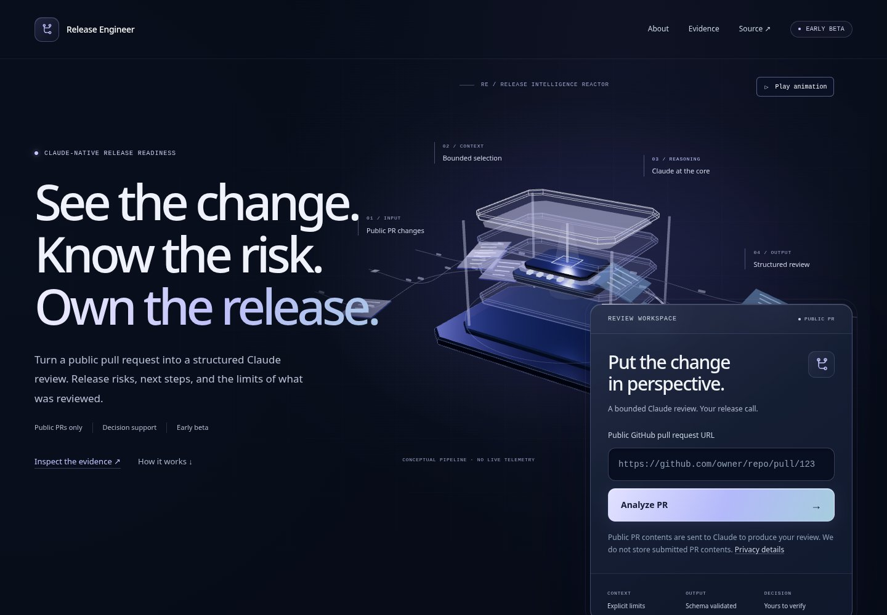
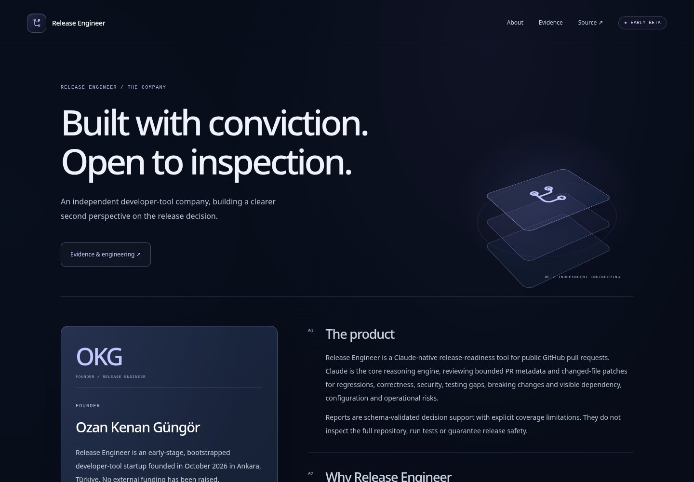
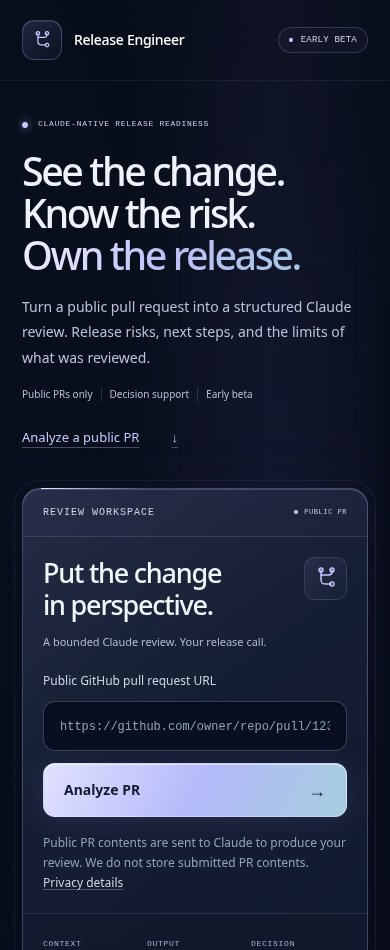
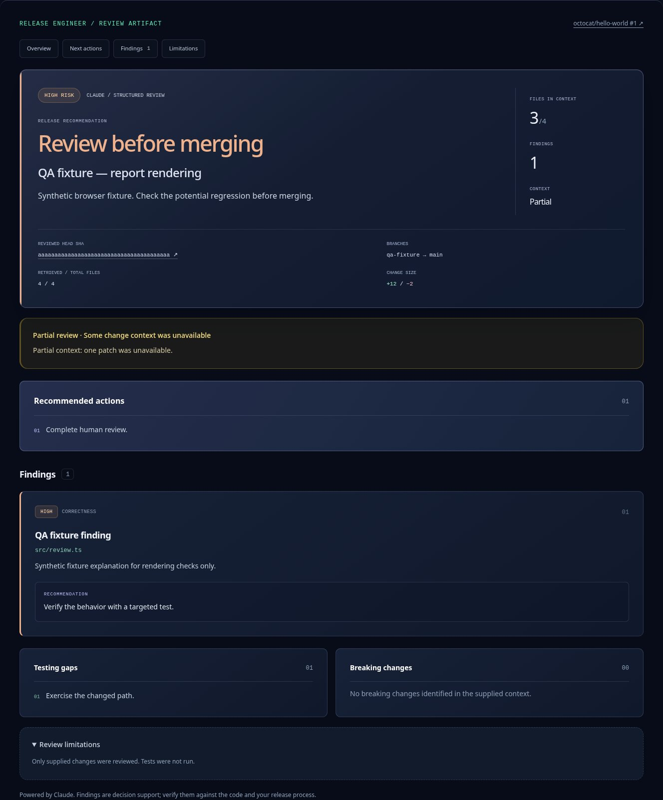

# Release Intelligence Reactor — visual release and verification

Baseline: `3cfaef769de822b044c156b22d190ca34a322231`, fetched from `origin/main` before changes. Branch: `design/release-intelligence-reactor`. Production Home, About, Evidence and mobile layouts were inspected in a real browser before implementation. These observations describe interface engineering and browser QA, not product accuracy or traction.

## Executive summary

The hero is now a spatial product composition: three-part release messaging, a large living reactor field, and a foreground review workspace. A new violet, ice and midnight palette, architectural surfaces, editorial feedback and clearer report hierarchy carry through the public site. The analysis console, real founder, early beta status, approved quotes, explicit coverage limits and evidence remain central.

## Visual and interaction changes

- **Hero:** a 1030 × 690 CSS-pixel scene at 1440px, expanding to 1150 × 740 at larger desktop widths. Large three-line messaging sits beside and over the incoming change field. The foreground console overlaps the reactor and output lanes. A semantic four-stage workflow rail follows the composition.
- **Console:** layered framing, an illuminated edge, dedicated titlebar, larger product heading, an integrated brand mark, recessed input, violet-to-ice CTA, focus treatment and truthful context/output/decision labels. Waiting uses an indeterminate light sequence; it does not claim measured progress or completed server phases. URL validation, loading, timeout, privacy disclosure, errors and submission logic retain their behavior.
- **Reports:** artifact navigation, prominent existing verdict, clear PR identity and pinned full head SHA, contextual statistics, an explicit partial-context warning, recommended actions before findings, severity edges and badges, contained recommendations, and initially open limitations. Values and verdict labels are unchanged. Severe findings receive restrained color emphasis.
- **Workflow and trust:** four architectural pipeline diagrams, individually framed stages, source inspection cards, clear evidence destinations and a more deliberate human-review closing section.
- **Testimonials:** the longest approved quote becomes a large editorial panel beside two smaller panels. All three exact approved quotes, aliases, roles, attribution and the evidence qualification remain. No rating, customer logo or tester PR link was added.
- **Founder:** a dedicated company statement, initials, visible founder facts and contact on Home; an expanded founder card and company facts on About. The October 2026 founding date, Ankara location, founder identity, bootstrapped status and absence of external funding remain.
- **About:** large editorial introduction, layered brand architecture, expanded founder surface and numbered, spaced verification sections. Existing evaluation failures, limits, source, security, contact and publication-consent text remain visible.
- **Evidence:** editorial heading, evidence principles and six numbered source records with the existing distinctions between source, synthetic observations, informal feedback, unpublished case studies and unverified usage counts.
- **Motion:** choreographed copy and console entrances, viewport-triggered native Web Animations with staggered panels, lift and border transitions, link emphasis, CTA light sweep, report reveals and a visible pause/play control for the conceptual scene. No motion library or other dependency was added.

## Exact 3D implementation

The existing pinned Three.js `0.182.0` and React Three Fiber `9.8.1` are retained. The scene shell contains no Three or Fiber import. `next/dynamic` loads the renderer with `ssr: false` only after eligible, visible desktop screens pass a capability check and a 650ms deferral. The SVG fallback is present in server HTML throughout loading.

The procedural reactor contains a chamfered metal chassis, four independently floating translucent context layers, a luminous reasoning module, a vertical light column, a sweeping context plane, structural supports and a rotating partial scan ring. Three deterministic curved branch lanes feed changes through the chamber and into the output field.

Nine change/output sheets, 36 document bars and 24 routing signals use three `InstancedMesh` draws. Sheets travel in ten-second loops and change tint as they pass the core; directional signals travel in 5.5-second loops. Layer separation, scanning, light intensity and ring movement continue after the entrance. Smoothed pointer parallax and slow root drift add depth without camera controls or interference with the form.

Geometry and materials are shared and explicitly disposed by their owning scene. Lights, resources, animation scheduling and shell visibility are separate modules. The demand renderer is scheduled at no more than 30Hz; observed slow cadence reduces DPR to 1 and the scheduling ceiling to 20Hz. Pausing, scrolling the scene out of view, and document visibility changes stop rendering. Resume resets frame timing to avoid a time jump.

This implementation uses [Fiber demand rendering](https://r3f.docs.pmnd.rs/advanced/scaling-performance) and [Three.js instancing](https://threejs.org/docs/pages/InstancedMesh.html). No textures, HDR maps, shadow maps, external scene assets, postprocessing, Drei, GSAP or Motion dependencies were added. The diagram is explicitly marked **conceptual pipeline / no live telemetry**.

## Difference from the previous release

The prior 790 × 445 field showed a small chip sculpture, a single five-second signal and demand rendering that settled to idle. The new field has approximately twice the canvas area at 1440px, an expanded vertical chamber, continuously moving change sheets and output, directional routing, scanning and light motion. The copy, scene and console now overlap as a larger composition. Reports, feedback and verification pages also have substantive hierarchy and material changes.

The new scene stays visibly active rather than relying on occasional pointer motion. Its additional movement is bounded by visibility, pause control, instancing, low geometry cost and resolution limits.

## Performance measurements

Both baseline and candidate were built locally with the same Node/pnpm/Next dependency versions. Initial JavaScript is the sum of files referenced by SSR homepage script tags, with each file independently gzipped using Node `gzipSync`. This is a build-size comparison, not transferred bytes or a production speed score.

| Measurement                         | Baseline | Candidate | Change |
| ----------------------------------- | -------: | --------: | -----: |
| Initial homepage JS, raw bytes      |  707,324 |   712,687 | +5,363 |
| Initial homepage JS, gzip bytes     |  218,711 |   220,304 | +1,593 |
| Deferred renderer chunk, raw bytes  |  894,504 |   896,926 | +2,422 |
| Deferred renderer chunk, gzip bytes |  240,413 |   241,196 |   +783 |

The renderer chunk is absent from initial SSR script references. A fresh 390px / DPR 3 browser requested no renderer chunk and created no canvas. The form was enabled while the scene still showed its fallback. Desktop DPR is capped at 1.5; the instrumented 1030 × 690 scene ran at DPR 1. Chromium WebGL2 instrumentation, including instanced draws, observed a maximum of **36 draws and 2,180 triangles per frame**. Draw counters stopped when paused, offscreen and during a simulated hidden-document visibility event, and resumed after play.

Software SwiftShader rendering was used for Chromium WebGL QA. These measurements do not establish hardware GPU frame rates, battery consumption, production LCP or Lighthouse scores. The documentation screenshots total approximately 423 KiB and live under `docs/`; the application does not request them.

## Accessibility and fallback protections

Copy, form, headings, identity, approved feedback, evidence and links remain server rendered. Without JavaScript, public pages remain readable and the existing analysis-submission explanation is visible. Reveals never depend on initially hidden content. Dynamic reports receive the existing completed-result focus.

The visual field is `aria-hidden`; Canvas is decorative and outside keyboard navigation. The scene's pause/play button is a normal labeled action outside the hidden visual wrapper. Keyboard skip navigation, input focus, form actions, report navigation and visible focus outlines were checked. Reduced motion disables CSS motion and native reveals and prevents WebGL from mounting. Forced colors use system form/action colors, remove decorative fields and preserve readable gradient headline text.

Mobile and coarse-pointer devices use the procedural SVG schematic, with bounded flow/scan animation when visible and motion is allowed. WebGL capability failure, renderer failure and actual context loss retain or restore that fallback without affecting submission or reports. The fallback is static for reduced motion and without JavaScript.

## Verification gates

All requested commands passed:

- `pnpm install --frozen-lockfile`
- `pnpm lint`
- `pnpm typecheck`
- `pnpm test` — 351 tests, 18 files
- `NEXT_TELEMETRY_DISABLED=1 pnpm build`
- `pnpm eval:validate` — 32 synthetic fixtures; no model called or scored
- `git diff --check`

The production build prerenders the public pages. No provider call, paid Claude analysis, prompt/model/evaluator change, API behavior change, report schema change or evidence-content change was made. A diff of `src/lib`, `src/app/api`, `src/content`, `evals`, `package.json` and `pnpm-lock.yaml` is empty. Public identity and publication-boundary tests pass unchanged.

## Production browser QA

Playwright against a local production `next start`. All `/api/analyze` browser interactions were intercepted with explicitly synthetic fixtures or aborted. No real analysis request was sent.

| Page / layout check                                   | 320  | 390  | 768  | 1024 | 1440 | 1920 |
| ----------------------------------------------------- | ---- | ---- | ---- | ---- | ---- | ---- |
| Homepage, approved quotes and trust sections          | Pass | Pass | Pass | Pass | Pass | Pass |
| About and founder identity                            | Pass | Pass | Pass | Pass | Pass | Pass |
| Evidence, Privacy and Terms                           | Pass | Pass | Pass | Pass | Pass | Pass |
| No horizontal overflow and resolving internal anchors | Pass | Pass | Pass | Pass | Pass | Pass |
| Long report paths, branches and unbroken text         | Pass | Pass | Pass | Pass | Pass | Pass |

Thirty public page/viewport combinations passed in Chromium. Actual desktop WebGL, continuous flow after entrance, pause/play, capped DPR, offscreen suspension and hidden-document suspension were exercised. Below 1024px there was no canvas. The direct mobile analysis anchor fits a 320 × 568 first screen and focuses the workspace.

Report checks passed for invalid URL, loading/disabled input, error/retry, rejected malformed response, completed full/partial context, all four risk severities, all three verdicts, empty findings, escaped HTML-like output, full head SHA, visible limitations and completed-report focus. Recommendations and warnings retain the supplied values and existing labels.

Axe WCAG 2/2.1 A/AA checks found **zero detected violations** on Home, About, Evidence, Privacy, Terms and the partial-context report fixture. Reduced motion, forced colors, no JavaScript, unavailable WebGL, actual `WEBGL_lose_context` fallback and unpublished case-route 404s passed. There were no application console errors, uncaught page errors or hydration warnings in the completed production matrix. Expected intercepted HTTP 429 and intentional case-route 404 network messages were classified separately. The software driver emitted a `WEBGL_lose_context extension not supported` warning during context-loss cleanup; the canvas unmounted and the usable fallback remained.

Firefox also passed Home, About, Evidence, Privacy and Terms at 390/1440, actual desktop WebGL, pause and reduced-motion teardown, with no console or page errors. Safari/WebKit and hardware GPU profiling were not available locally.

The following image is a **synthetic browser fixture** for report presentation, not a real Claude review, public PR case study or product-use observation:

## Files and scope

| Area                                    | Files                                                                                                                                                                                 |
| --------------------------------------- | ------------------------------------------------------------------------------------------------------------------------------------------------------------------------------------- |
| Public pages / global design            | `src/app/page.tsx`, `src/app/about/page.tsx`, `src/app/evidence/page.tsx`, `src/app/globals.css`, `src/app/layout.tsx`                                                                |
| Product surfaces / motion               | `src/components/analysis-form.tsx`, `src/components/review-report.tsx`, `src/components/testimonials.tsx`, `src/components/motion-surfaces.tsx`                                       |
| Reactor shell / lifecycle               | `src/components/three/release-intelligence-scene.tsx`, `src/components/three/use-scene-visibility.ts`, `src/components/three/scene-canvas.tsx`, `src/components/three/scene-hooks.ts` |
| Reactor geometry / materials / fallback | `src/components/three/release-reactor-scene.tsx`, `src/components/three/scene-materials.ts`, `src/components/three/scene-lights.tsx`, `src/components/three/scene-fallback.tsx`       |
| Development guidance                    | `AGENTS.md`, automatically generated by this version of `next dev`; local Next guides were read                                                                                       |
| Review record                           | `docs/release-reactor-qa.md` and four JPEGs under `docs/release-reactor/`                                                                                                             |

## Tradeoffs and remaining ideas

The live conceptual scene uses more visible rendering time than the former settling sculpture. Scheduling, adaptive resolution, suspension and an explicit pause control bound that cost. Mobile uses the animated schematic rather than a WebGL renderer. The animation represents the workflow and is not a measurement of a running review.

Follow-up device work can profile Safari and hardware GPUs, and tune the reactor camera after founder review. No accuracy, traction, endorsement, customer, safety guarantee or new social proof is inferred from this visual release. Remote CI and deployment outcomes belong to the PR record after its final commit; this document reports local results.
